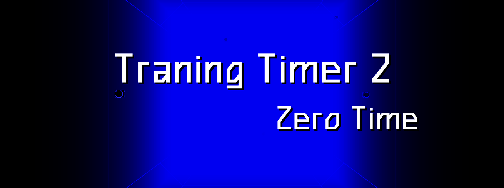

# Training Timer 2: Zero Time

New Version of [Training Timer](https://github.com/SerufuYua/training_timer)

This app is designed for tracking training time in various sports, from martial arts (boxing, MMA, etc.) to swimming and much more.

Professional mode allows you to set any custom time periods with any sounds and signal colors. You can create your own chains of periods: progressive, regressive, with an extended rest period in the middle, and much more.

The application is completely free and open source.

Using [Castle Game Engine](https://castle-engine.io/).

## Building

Compile by:

- [CGE editor](https://castle-engine.io/editor). Just use menu items _"Compile"_ or _"Compile And Run"_.

- Or use [CGE command-line build tool](https://castle-engine.io/build_tool). Run `castle-engine compile` in this directory.

- Or use [Lazarus](https://www.lazarus-ide.org/). Open in Lazarus `TrainingTimer2_standalone.lpi` file and compile / run from Lazarus. Make sure to first register [CGE Lazarus packages](https://castle-engine.io/lazarus).

- Or use [Delphi](https://www.embarcadero.com/products/Delphi). Open in Delphi `TrainingTimer2_standalone.dproj` file and compile / run from Delphi. See [CGE and Delphi](https://castle-engine.io/delphi) documentation for details.