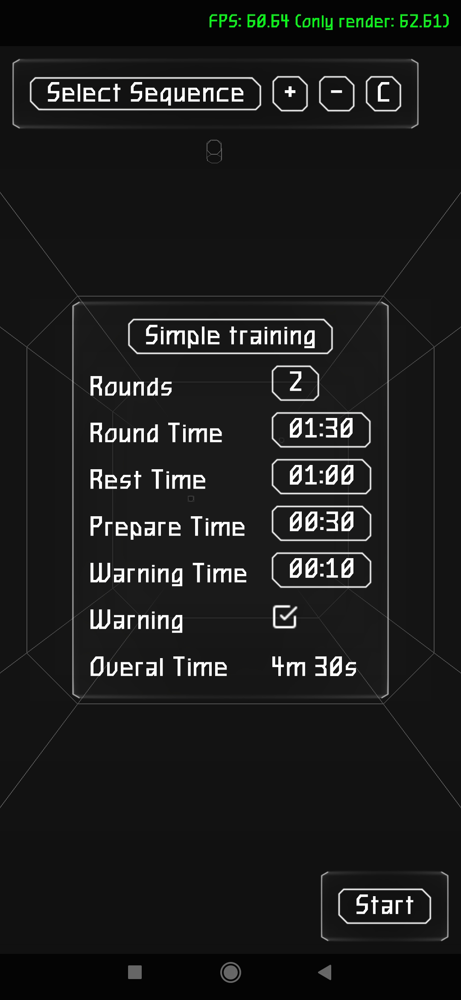
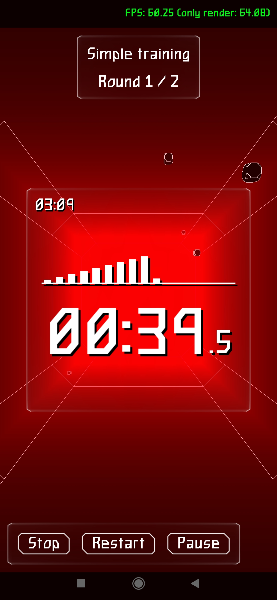

# Training Timer 2: Zero Time

New Version of [Training Timer](https://github.com/SerufuYua/training_timer)

 

This app is designed for tracking training time in various sports, from martial arts (boxing, MMA, etc.) to swimming and much more.

The application is completely free and open source.

Supported platforms: Windows and Android.

Using [Castle Game Engine](https://castle-engine.io/).

## Binaries

Binaries available on [itch.io](https://serufuyua.itch.io/training-timer-2-zero-time) and [GitHub](https://github.com/SerufuYua/training_timer_2/releases)

## Building

### Compile for Windows:

- [CGE editor](https://castle-engine.io/editor). Just use menu items _"Compile"_ or _"Compile And Run"_.

- Or use [CGE command-line build tool](https://castle-engine.io/build_tool). Run `castle-engine compile` in this directory.

- Or use [Lazarus](https://www.lazarus-ide.org/). Open in Lazarus `TrainingTimer2_standalone.lpi` file and compile / run from Lazarus. Make sure to first register [CGE Lazarus packages](https://castle-engine.io/lazarus).

- Or use [Delphi](https://www.embarcadero.com/products/Delphi). Open in Delphi `TrainingTimer2_standalone.dproj` file and compile / run from Delphi. See [CGE and Delphi](https://castle-engine.io/delphi) documentation for details.

### Compile for Android:

- Copy content of [android_services](./android_services) folder to _Castle_Game_Engine_path_\tools\build-tool\data\android\ to support special Android fetures.

- Follow this [Guide](https://castle-engine.io/android).

- How to [Signing a release APK/AAB](https://castle-engine.io/android_faq#_signing_a_release_apk_aab).
